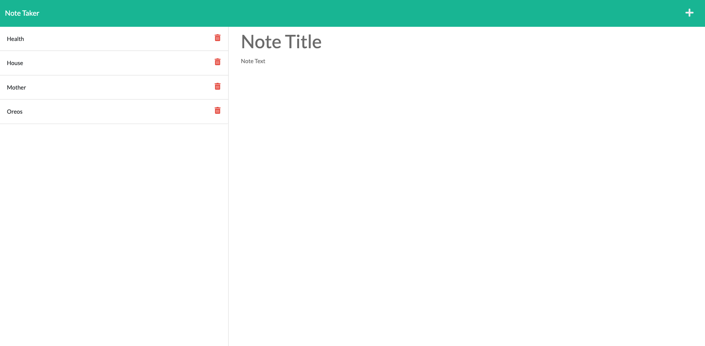

# Note Taker Starter Code

## **Goal**
*As a small business owner, I want to be able to write and save notes so that I can organize my thoughts and keep track of tasks I need to complete*

 

## Application Details
- A note-taking application with a landing page with a link to a notes page
- When I click on the link to the notes page then I am presented with a page with existing notes listed in the left-hand column, plus empty fields to enter a new note title and the note’s text in the right-hand column
- When I enter a new note title and the note’s text then a Save icon appears in the navigation at the top of the page
- When I click on the Save icon then the new note I have entered is saved and appears in the left-hand column with the other existing notes
- When I click on an existing note in the list in the left-hand column then that note appears in the right-hand column
- When I click on the Write icon in the navigation at the top of the page then I am presented with empty fields to enter a new note title and the note’s text in the right-hand column

----

 

## Challenges Faced
- Once I created the delete route in the api routes page, I was having trouble forcing the page to reload so that it would populate the new updated data. I realized that I could not access the DOM from the node.js server, and had to update the front-end side JS file with a document.location.reload() function in the correct spot so that it would only reload the page at the correct time.

 

## *Links to the GitHub & Heroku repositories*

- **[Link to the GitHub Repository](https://github.com/Doctor-Worm/Miniature-Eureka)**

- **[Link to the deployed Heroku app](https://whispering-gorge-49441.herokuapp.com/)**

